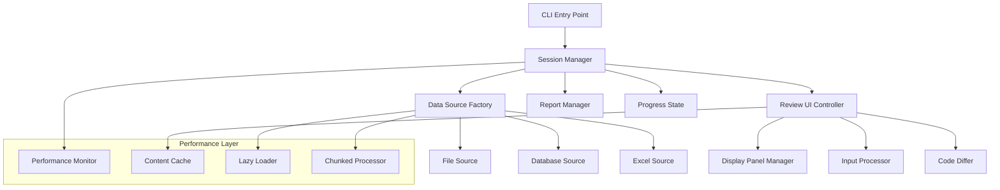
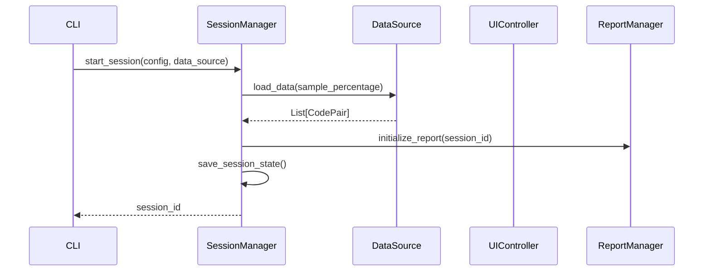
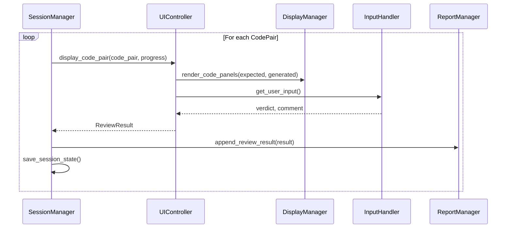
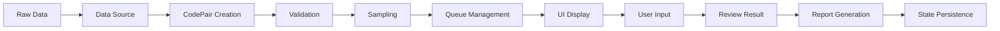

# VAITP-Auditor Developer Guide

## Overview

This guide provides comprehensive information for developers who want to understand, extend, or contribute to the VAITP-Auditor system. The application follows a modular architecture with clear separation of concerns and extensive testing.

## Table of Contents

1. [Architecture Overview](#architecture-overview)
2. [Project Structure](#project-structure)
3. [Core Components](#core-components)
4. [Data Flow](#data-flow)
5. [Extending the System](#extending-the-system)
6. [Testing Strategy](#testing-strategy)
7. [Performance Considerations](#performance-considerations)
8. [Contributing Guidelines](#contributing-guidelines)
9. [API Reference](#api-reference)

## Architecture Overview

### Design Principles

The VAITP-Auditor follows these key architectural principles:

1. **Separation of Concerns**: Clear boundaries between data loading, UI rendering, and business logic
2. **Plugin Architecture**: Data sources implement a common interface for easy extension
3. **State Management**: Session state is persisted atomically to prevent data loss
4. **Responsive UI**: Non-blocking operations with efficient screen updates
5. **Error Resilience**: Graceful degradation with comprehensive error handling
6. **Performance Optimization**: Lazy loading, caching, and memory management

### High-Level Architecture



### Technology Stack

- **Core Language**: Python 3.8+
- **UI Framework**: Rich (terminal-based UI)
- **Data Processing**: pandas, openpyxl
- **Testing**: pytest
- **Performance**: psutil (optional)
- **Packaging**: setuptools

## Project Structure

```
vaitp_auditor/
├── __init__.py                 # Package initialization
├── cli.py                      # Command-line interface
├── session_manager.py          # Main orchestration logic
│
├── core/                       # Core business logic
│   ├── __init__.py
│   ├── models.py              # Data models and validation
│   └── differ.py              # Code difference computation
│
├── data_sources/              # Data source implementations
│   ├── __init__.py
│   ├── base.py               # Abstract base class
│   ├── factory.py            # Data source factory
│   ├── filesystem.py         # File system source
│   ├── sqlite.py             # SQLite database source
│   └── excel.py              # Excel/CSV source
│
├── ui/                        # User interface components
│   ├── __init__.py
│   ├── review_controller.py   # Main UI controller
│   ├── display_manager.py     # Terminal rendering
│   ├── input_handler.py       # User input processing
│   ├── diff_renderer.py       # Diff visualization
│   ├── scroll_manager.py      # Scrolling and navigation
│   └── keyboard_input.py      # Keyboard handling
│
├── reporting/                 # Report generation
│   ├── __init__.py
│   └── report_manager.py      # Excel/CSV report generation
│
└── utils/                     # Utility modules
    ├── __init__.py
    ├── logging_config.py      # Logging configuration
    ├── error_handling.py      # Error handling utilities
    ├── resource_manager.py    # Resource management
    └── performance.py         # Performance optimizations

tests/                         # Test suite
├── test_*.py                 # Unit tests
├── test_performance.py       # Performance tests
├── test_cross_platform.py   # Cross-platform tests
└── test_comprehensive_integration.py  # Integration tests

docs/                         # Documentation
├── USER_GUIDE.md            # User documentation
├── DEVELOPER_GUIDE.md       # This file
└── API_REFERENCE.md         # API documentation
```

## Core Components

### 1. Session Manager (`session_manager.py`)

**Purpose**: Orchestrates the overall review workflow and manages session lifecycle.

**Key Responsibilities**:
- Coordinates between data sources, UI, and reporting
- Manages session state persistence
- Handles session resumption and recovery
- Monitors performance and resource usage

**Key Methods**:
```python
class SessionManager:
    def start_session(self, config: SessionConfig, data_source: DataSource) -> str
    def resume_session(self, session_id: str) -> bool
    def process_review_queue(self) -> None
    def get_review_for_pair(self, code_pair: CodePair) -> ReviewResult
    def undo_last_review(self) -> bool
    def save_session_state(self) -> None
```

**Design Patterns**:
- **Coordinator Pattern**: Orchestrates interactions between components
- **State Pattern**: Manages different session states
- **Observer Pattern**: Monitors performance and resource usage

### 2. Data Source Interface (`data_sources/base.py`)

**Purpose**: Provides a common interface for all data source implementations.

**Abstract Interface**:
```python
class DataSource(ABC):
    @abstractmethod
    def configure(self) -> bool
    
    @abstractmethod
    def load_data(self, sample_percentage: float) -> List[CodePair]
    
    @abstractmethod
    def get_total_count(self) -> int
```

**Error Handling**:
- Encoding fallback (UTF-8 → latin-1)
- Graceful degradation for missing files
- Comprehensive logging with context

**Performance Features**:
- Lazy loading for large files
- Chunked processing for large datasets
- Memory usage monitoring

### 3. Review UI Controller (`ui/review_controller.py`)

**Purpose**: Stateless component that displays individual code pairs and handles user input.

**Key Components**:
- `DisplayManager`: Renders code panels with syntax highlighting
- `InputHandler`: Processes keyboard input and commands
- `ScrollManager`: Handles vertical and horizontal scrolling
- `DiffRenderer`: Interprets diff tags and applies color coding

**Design Patterns**:
- **MVC Pattern**: Separates display, input, and control logic
- **Strategy Pattern**: Different rendering strategies for different content types
- **Command Pattern**: User input translated to commands

### 4. Code Differ (`core/differ.py`)

**Purpose**: Pure data-processing component for computing code differences.

**Features**:
- Line-by-line difference computation using `difflib`
- Caching for performance optimization
- Chunked processing for very large files
- Multiple output formats (structured data and unified diff)

**Performance Optimizations**:
- Result caching with MD5 keys
- Large file detection and special handling
- Memory-efficient chunked processing

### 5. Report Manager (`reporting/report_manager.py`)

**Purpose**: Manages output file generation with atomic writes.

**Features**:
- Excel and CSV format support
- Atomic write operations for data integrity
- Undo support for review corrections
- Comprehensive metadata tracking

## Data Flow

### 1. Session Initialization



### 2. Review Loop



### 3. Data Processing Pipeline



## Extending the System

### Adding New Data Sources

1. **Create new data source class**:

```python
from .base import DataSource
from ..core.models import CodePair

class MyDataSource(DataSource):
    def configure(self) -> bool:
        # Implement configuration logic
        # Return True if successful, False otherwise
        pass
    
    def load_data(self, sample_percentage: float) -> List[CodePair]:
        # Implement data loading logic
        # Apply sampling and return CodePair objects
        pass
    
    def get_total_count(self) -> int:
        # Return total number of available items
        pass
```

2. **Register in factory** (`data_sources/factory.py`):

```python
def create_data_source(source_type: str) -> Optional[DataSource]:
    sources = {
        'folders': FileSystemSource,
        'sqlite': SQLiteSource,
        'excel': ExcelSource,
        'my_source': MyDataSource,  # Add your source
    }
    # ... rest of factory logic
```

3. **Add to CLI options** (`cli.py`):

```python
def select_data_source():
    print("Select data source:")
    print("1. Folders (file system)")
    print("2. SQLite database")
    print("3. Excel/CSV file")
    print("4. My Custom Source")  # Add option
    # ... handle selection
```

### Adding New UI Components

1. **Create component class**:

```python
class MyUIComponent:
    def __init__(self):
        self.console = Console()
    
    def render(self, data):
        # Implement rendering logic
        pass
    
    def handle_input(self, key):
        # Implement input handling
        pass
```

2. **Integrate with ReviewUIController**:

```python
class ReviewUIController:
    def __init__(self):
        # ... existing components
        self.my_component = MyUIComponent()
    
    def display_code_pair(self, code_pair, progress_info, experiment_name):
        # ... existing logic
        self.my_component.render(some_data)
```

### Adding New Report Formats

1. **Extend ReportManager**:

```python
class ReportManager:
    def _create_my_format_report(self, session_id: str):
        # Implement new format logic
        pass
    
    def initialize_report(self, session_id: str, output_format: str):
        if output_format == 'my_format':
            self._create_my_format_report(session_id)
        # ... existing logic
```

### Adding Performance Optimizations

1. **Create optimization class**:

```python
from ..utils.performance import performance_monitor

class MyOptimization:
    @performance_monitor("my_operation")
    def optimize_operation(self, data):
        # Implement optimization
        pass
```

2. **Integrate with existing components**:

```python
from ..utils.performance import get_performance_monitor

class ExistingComponent:
    def __init__(self):
        self.monitor = get_performance_monitor()
        self.optimization = MyOptimization()
```

## Testing Strategy

### Test Categories

1. **Unit Tests**: Test individual components in isolation
2. **Integration Tests**: Test component interactions
3. **Performance Tests**: Validate performance requirements
4. **Cross-Platform Tests**: Ensure compatibility across OS
5. **End-to-End Tests**: Test complete workflows

### Test Structure

```python
class TestMyComponent:
    """Test suite for MyComponent."""
    
    def setup_method(self):
        """Set up test fixtures."""
        self.component = MyComponent()
    
    def test_basic_functionality(self):
        """Test basic component functionality."""
        result = self.component.do_something()
        assert result is not None
    
    def test_error_handling(self):
        """Test error handling."""
        with pytest.raises(ExpectedError):
            self.component.do_invalid_operation()
    
    def test_performance(self):
        """Test performance requirements."""
        start_time = time.time()
        self.component.do_heavy_operation()
        duration = time.time() - start_time
        assert duration < 1.0  # Should complete within 1 second
```

### Running Tests

```bash
# Run all tests
pytest

# Run specific test category
pytest tests/test_performance.py

# Run with coverage
pytest --cov=vaitp_auditor

# Run cross-platform tests
pytest tests/test_cross_platform.py

# Run performance tests only
pytest -m performance
```

### Test Data Management

```python
@pytest.fixture
def sample_code_pair():
    """Provide sample CodePair for testing."""
    return CodePair(
        identifier="test_pair",
        expected_code="def hello(): return 'world'",
        generated_code="def hello(): return 'universe'",
        source_info={"test": True}
    )

@pytest.fixture
def temp_directory():
    """Provide temporary directory for file tests."""
    with tempfile.TemporaryDirectory() as temp_dir:
        yield Path(temp_dir)
```

## Performance Considerations

### Memory Management

1. **Lazy Loading**: Large files loaded only when needed
2. **Content Caching**: Frequently accessed content cached with LRU eviction
3. **Chunked Processing**: Large datasets processed in manageable chunks
4. **Garbage Collection**: Automatic cleanup when memory limits approached

### Optimization Strategies

1. **Caching**:
   - Diff computation results
   - Syntax highlighting objects
   - File content for repeated access

2. **Lazy Evaluation**:
   - File content loading
   - Syntax highlighting computation
   - Diff calculation

3. **Memory Monitoring**:
   - Automatic garbage collection triggers
   - Memory usage tracking
   - Performance metrics collection

### Performance Targets

- **Code pair display**: < 100ms
- **User input response**: < 50ms
- **Memory usage**: < 1GB for 10,000 code pairs
- **Session initialization**: < 5 seconds

### Monitoring and Profiling

```python
from vaitp_auditor.utils.performance import get_performance_monitor

# Get performance statistics
monitor = get_performance_monitor()
summary = monitor.get_summary()
print(f"Average diff computation time: {summary['compute_diff']['avg_duration']:.3f}s")

# Monitor specific operations
@performance_monitor("custom_operation")
def my_function():
    # Function implementation
    pass
```

## Contributing Guidelines

### Code Style

1. **PEP 8 Compliance**: Follow Python style guidelines
2. **Type Hints**: Use type hints for all public APIs
3. **Docstrings**: Comprehensive docstrings for all classes and methods
4. **Error Handling**: Explicit error handling with appropriate exceptions

### Documentation Requirements

1. **Code Documentation**: Inline comments for complex logic
2. **API Documentation**: Complete docstrings with examples
3. **User Documentation**: Update user guide for new features
4. **Developer Documentation**: Update this guide for architectural changes

### Testing Requirements

1. **Unit Test Coverage**: Minimum 80% coverage for new code
2. **Integration Tests**: Test component interactions
3. **Performance Tests**: Validate performance requirements
4. **Cross-Platform Tests**: Ensure compatibility

### Pull Request Process

1. **Feature Branch**: Create feature branch from main
2. **Tests**: Add comprehensive tests for new functionality
3. **Documentation**: Update relevant documentation
4. **Code Review**: Submit pull request for review
5. **CI/CD**: Ensure all automated tests pass

### Development Setup

```bash
# Clone repository
git clone <repository-url>
cd vaitp-auditor

# Create virtual environment
python -m venv venv
source venv/bin/activate  # On Windows: venv\Scripts\activate

# Install development dependencies
pip install -e ".[dev]"

# Run tests
pytest

# Run linting
flake8 vaitp_auditor/
mypy vaitp_auditor/

# Run formatting
black vaitp_auditor/
isort vaitp_auditor/
```

## API Reference

### Core Models

#### CodePair

```python
@dataclass
class CodePair:
    identifier: str                    # Unique identifier
    expected_code: Optional[str]       # Ground truth code (optional)
    generated_code: str               # Generated code to review
    source_info: Dict[str, Any]       # Source-specific metadata
    
    def validate_integrity(self) -> bool:
        """Validate code pair integrity."""
```

#### ReviewResult

```python
@dataclass
class ReviewResult:
    review_id: int                    # Unique review identifier
    source_identifier: str            # Original source identifier
    experiment_name: str              # Experiment name
    review_timestamp_utc: datetime    # Review completion time
    reviewer_verdict: str             # Classification result
    reviewer_comment: str             # Optional comment
    time_to_review_seconds: float     # Time spent reviewing
    expected_code: Optional[str]      # Full expected code
    generated_code: str               # Full generated code
    code_diff: str                    # Unified diff output
```

### Data Source Interface

```python
class DataSource(ABC):
    @abstractmethod
    def configure(self) -> bool:
        """Configure the data source with user input."""
    
    @abstractmethod
    def load_data(self, sample_percentage: float) -> List[CodePair]:
        """Load code pairs with optional sampling."""
    
    @abstractmethod
    def get_total_count(self) -> int:
        """Get total number of available code pairs."""
```

### Performance Utilities

```python
# Performance monitoring
@performance_monitor("operation_name")
def my_function():
    pass

# Content caching
cache = get_content_cache()
cached_content = cache.get("key")
cache.put("key", "content")

# Lazy loading
loader = LazyLoader(lambda: expensive_operation())
content = loader.content  # Loads only when accessed

# Chunked processing
processor = get_chunked_processor()
results = processor.process_chunks(items, process_function)
```

### Error Handling

```python
from vaitp_auditor.utils.error_handling import handle_errors, SessionError

@handle_errors(error_types=(ValueError, IOError), context={'operation': 'file_read'})
def risky_operation():
    # Implementation that might raise errors
    pass

# Custom exceptions
raise SessionError("Session initialization failed")
```

This developer guide provides the foundation for understanding and extending the VAITP-Auditor system. The modular architecture and comprehensive testing make it straightforward to add new features while maintaining system reliability and performance.