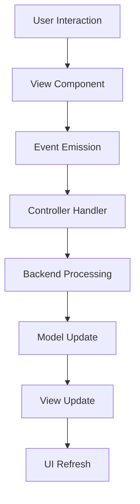

# VAITP-Auditor GUI Developer Guide

## Overview

This guide provides comprehensive documentation for developers who want to extend, modify, or contribute to the VAITP-Auditor GUI. The GUI is built using CustomTkinter and follows a strict MVC (Model-View-Controller) architecture pattern.

## Table of Contents

1. [Architecture Overview](#architecture-overview)
2. [Development Environment](#development-environment)
3. [Core Components](#core-components)
4. [Extending the GUI](#extending-the-gui)
5. [Performance Optimization](#performance-optimization)
6. [Testing Framework](#testing-framework)
7. [Accessibility Guidelines](#accessibility-guidelines)
8. [Deployment and Packaging](#deployment-and-packaging)

## Architecture Overview

### Design Principles

The VAITP-Auditor GUI follows these key design principles:

1. **Seamless Integration**: Reuses existing backend components without modification
2. **MVC Architecture**: Clear separation between View, Controller, and Model layers
3. **Event-Driven Design**: Views emit events, Controllers handle business logic
4. **Performance First**: Optimized for large datasets and responsive UI
5. **Accessibility**: Full keyboard navigation and screen reader support

### Component Hierarchy

```
GUI Application
├── Setup Wizard (Configuration)
│   ├── NamingStep
│   ├── DataSourceStep
│   ├── ConfigurationStep
│   └── FinalizationStep
├── Main Review Window (Review Interface)
│   ├── HeaderFrame (Progress Display)
│   ├── CodePanelsFrame (Code Comparison)
│   └── ActionsFrame (Verdict Selection)
├── Session Controller (Business Logic)
├── Performance Optimizer (Optimization)
└── Accessibility Manager (A11y Support)
```

### Event Flow



## Development Environment

### Prerequisites

- **Python**: 3.8 or higher
- **CustomTkinter**: 5.0.0 or higher
- **Development Tools**: pytest, black, mypy
- **Optional**: psutil for performance monitoring

### Setup Development Environment

1. **Clone Repository**:
   ```bash
   git clone <repository-url>
   cd vaitp-auditor
   ```

2. **Create Virtual Environment**:
   ```bash
   python -m venv venv
   source venv/bin/activate  # On Windows: venv\Scripts\activate
   ```

3. **Install Dependencies**:
   ```bash
   pip install -e .[gui,dev]
   ```

4. **Run Tests**:
   ```bash
   pytest tests/test_gui_*.py -v
   ```

### Project Structure

```
vaitp_auditor/
├── gui/                          # GUI components
│   ├── __init__.py
│   ├── gui_app.py               # Main application entry point
│   ├── setup_wizard.py          # Setup wizard implementation
│   ├── main_review_window.py    # Main review interface
│   ├── gui_session_controller.py # MVC controller
│   ├── code_display.py          # Code panels with highlighting
│   ├── models.py                # GUI-specific data models
│   ├── accessibility.py         # Accessibility features
│   ├── accessibility_settings.py # A11y configuration
│   ├── error_handler.py         # GUI error handling
│   └── performance_optimizer.py # Performance optimizations
├── core/                        # Existing backend (unchanged)
├── data_sources/               # Data source implementations
├── utils/                      # Utility modules
└── tests/                      # Test suite
    ├── test_gui_*.py           # GUI-specific tests
    ├── gui_test_framework.py   # Testing utilities
    └── README_GUI_Testing.md   # Testing documentation
```

## Core Components

### 1. GUIApplication (`gui_app.py`)

The main application entry point that manages the application lifecycle.

```python
class GUIApplication:
    """Main GUI application controller."""
    
    def __init__(self):
        self.setup_wizard = None
        self.main_window = None
        self.session_controller = None
    
    def run(self) -> None:
        """Start the GUI application."""
        # Implementation details...
    
    def launch_setup_wizard(self) -> None:
        """Launch the setup wizard."""
        # Implementation details...
    
    def launch_main_review(self, session_config: SessionConfig) -> None:
        """Launch main review window with configuration."""
        # Implementation details...
```

**Key Responsibilities**:
- Application lifecycle management
- Window coordination and transitions
- Error handling and recovery
- Resource cleanup

**Extension Points**:
- Add new application modes
- Customize startup behavior
- Implement additional error recovery strategies

### 2. SetupWizard (`setup_wizard.py`)

Multi-step configuration interface using the Step pattern.

```python
class SetupWizard(ctk.CTkToplevel):
    """Multi-step setup wizard for session configuration."""
    
    def __init__(self, parent: ctk.CTk):
        super().__init__(parent)
        self.steps = [
            NamingStep(self),
            DataSourceStep(self),
            ConfigurationStep(self),
            FinalizationStep(self)
        ]
    
    def show_step(self, step_number: int) -> None:
        """Display a specific wizard step."""
        # Implementation details...

class SetupStep(ABC):
    """Abstract base class for wizard steps."""
    
    @abstractmethod
    def create_widgets(self, parent: ctk.CTkFrame) -> None:
        """Create step-specific widgets."""
        pass
    
    @abstractmethod
    def validate(self) -> bool:
        """Validate step input."""
        pass
    
    @abstractmethod
    def get_data(self) -> Dict[str, Any]:
        """Get step configuration data."""
        pass
```

**Adding New Steps**:

1. **Create Step Class**:
   ```python
   class CustomStep(SetupStep):
       def create_widgets(self, parent):
           # Create your UI components
           pass
       
       def validate(self):
           # Validate user input
           return True
       
       def get_data(self):
           # Return configuration data
           return {"custom_setting": self.value}
   ```

2. **Register Step**:
   ```python
   # In SetupWizard.__init__
   self.steps.append(CustomStep(self))
   ```

### 3. MainReviewWindow (`main_review_window.py`)

The primary review interface with three-section layout.

```python
class MainReviewWindow(ctk.CTk):
    """Main review window with code comparison and verdict selection."""
    
    def __init__(self, session_controller: 'GUISessionController'):
        super().__init__()
        self.session_controller = session_controller
        self.setup_layout()
    
    def load_code_pair(self, code_pair: CodePair) -> None:
        """Load a code pair for review."""
        # Implementation details...
    
    def emit_verdict_selected(self, verdict_id: str) -> None:
        """Emit verdict selection event."""
        if self.verdict_callback:
            comment = self.actions_frame.get_comment()
            self.verdict_callback(verdict_id, comment)
```

**Customizing the Interface**:

1. **Add New Verdict Types**:
   ```python
   # In models.py
   def get_custom_verdict_buttons():
       return [
           VerdictButtonConfig(
               verdict_id="CUSTOM_VERDICT",
               display_text="Custom",
               key_binding="c",
               color_theme="info",
               tooltip="Custom verdict type"
           )
       ]
   ```

2. **Extend Actions Frame**:
   ```python
   class ExtendedActionsFrame(ActionsFrame):
       def _create_additional_controls(self):
           # Add custom controls
           pass
   ```

### 4. GUISessionController (`gui_session_controller.py`)

MVC controller that bridges GUI and backend components.

```python
class GUISessionController:
    """Controller for GUI session management following MVC pattern."""
    
    def __init__(self, main_window: MainReviewWindow):
        self.main_window = main_window
        self.session_manager = None
        self.current_session = None
    
    def submit_verdict(self, verdict_id: str, comment: str = "") -> None:
        """Handle verdict submission from GUI."""
        # Process verdict through backend
        # Update view state
        # Load next code pair
    
    def handle_undo_request(self) -> None:
        """Handle undo request from GUI."""
        # Validate undo possibility
        # Process undo through backend
        # Update view state
```

**Extending Controller Logic**:

1. **Add Custom Event Handlers**:
   ```python
   def handle_custom_action(self, action_data: Dict[str, Any]) -> None:
       """Handle custom action from GUI."""
       # Process custom action
       # Update backend state
       # Refresh view
   ```

2. **Implement Custom Workflows**:
   ```python
   def start_custom_workflow(self, workflow_config: Dict[str, Any]) -> None:
       """Start a custom review workflow."""
       # Initialize custom workflow
       # Configure UI for workflow
       # Begin processing
   ```

## Extending the GUI

### Adding New Data Sources

1. **Implement Data Source**:
   ```python
   # In data_sources/custom_source.py
   class CustomDataSource(DataSourceBase):
       def load_code_pairs(self) -> List[CodePair]:
           # Load from custom source
           pass
   ```

2. **Add Configuration Step**:
   ```python
   class CustomConfigurationStep(SetupStep):
       def create_widgets(self, parent):
           # Create configuration UI
           pass
   ```

3. **Register in Factory**:
   ```python
   # In data_sources/factory.py
   def create_data_source(source_type: str, config: Dict[str, Any]):
       if source_type == "custom":
           return CustomDataSource(config)
   ```

### Creating Custom Widgets

1. **Extend Base Components**:
   ```python
   class CustomCodePanel(CodePanel):
       """Extended code panel with custom features."""
       
       def __init__(self, parent, title, **kwargs):
           super().__init__(parent, title, **kwargs)
           self.add_custom_features()
       
       def add_custom_features(self):
           # Add custom functionality
           pass
   ```

2. **Follow Accessibility Guidelines**:
   ```python
   def setup_accessibility(self):
       if self.accessibility_manager:
           self.accessibility_manager.register_widget(
               self.custom_widget,
               label="Custom widget",
               description="Description for screen readers",
               tab_order=10
           )
   ```

### Implementing Custom Themes

1. **Create Theme Configuration**:
   ```json
   {
     "name": "custom_theme",
     "colors": {
       "primary": "#1f2937",
       "secondary": "#374151",
       "accent": "#3b82f6",
       "text": "#f9fafb",
       "background": "#111827"
     },
     "fonts": {
       "default": {"family": "Arial", "size": 11},
       "code": {"family": "Consolas", "size": 10}
     }
   }
   ```

2. **Apply Theme**:
   ```python
   class ThemeManager:
       def apply_theme(self, theme_config: Dict[str, Any]):
           # Apply colors to widgets
           # Update font configurations
           # Refresh UI components
   ```

## Performance Optimization

### Lazy Loading Implementation

The GUI includes sophisticated lazy loading for large code files:

```python
class LazyCodeLoader:
    """Lazy loader for large code content."""
    
    def __init__(self, code_content: str, max_preview_lines: int = 50):
        self.full_content = code_content
        self.max_preview_lines = max_preview_lines
        self._is_large = len(code_content) > 10000
    
    def get_content(self, force_full: bool = False) -> str:
        """Get content with lazy loading optimization."""
        if force_full or not self.is_large:
            return self.full_content
        return self.get_preview()
```

### Caching Strategy

Multiple caching layers optimize performance:

1. **Syntax Highlighting Cache**:
   ```python
   class SyntaxHighlightingCache:
       def get(self, content: str, language: str) -> Optional[List[Tuple[str, str]]]:
           # Return cached highlighting result
       
       def put(self, content: str, language: str, result: List[Tuple[str, str]]):
           # Cache highlighting result with LRU eviction
   ```

2. **Content Cache**:
   ```python
   class ContentCache:
       def optimize_for_size(self, content: str) -> str:
           # Apply size-based optimizations
           # Return optimized content
   ```

### Memory Management

```python
class MemoryManager:
    """Manages memory usage for GUI components."""
    
    def register_widget(self, widget: ctk.CTkBaseClass) -> None:
        """Register widget for memory tracking."""
    
    def cleanup_widgets(self) -> None:
        """Clean up destroyed widgets."""
    
    def check_memory_usage(self) -> Dict[str, Any]:
        """Monitor current memory usage."""
```

### Performance Monitoring

```python
@performance_optimized("custom_operation")
def custom_operation():
    """Decorated function with performance monitoring."""
    # Function implementation
    pass

# Usage in components
optimizer = get_performance_optimizer()
stats = optimizer.get_performance_summary()
```

## Testing Framework

### GUI Testing Utilities

The project includes a comprehensive GUI testing framework:

```python
class GUITestFramework:
    """Framework for testing GUI components."""
    
    def setup_test_window(self) -> ctk.CTk:
        """Create test window for GUI components."""
    
    def simulate_user_input(self, widget: ctk.CTkWidget, value: Any) -> None:
        """Simulate user input on widgets."""
    
    def capture_window_state(self, window: ctk.CTk) -> Dict[str, Any]:
        """Capture current window state for assertions."""
    
    def assert_widget_state(self, widget: ctk.CTkWidget, expected: Dict[str, Any]):
        """Assert widget state matches expectations."""
```

### Writing GUI Tests

1. **Component Tests**:
   ```python
   class TestCustomComponent(unittest.TestCase):
       def setUp(self):
           self.test_framework = GUITestFramework()
           self.test_window = self.test_framework.setup_test_window()
       
       def test_component_behavior(self):
           component = CustomComponent(self.test_window)
           self.test_framework.simulate_user_input(component, "test_value")
           state = self.test_framework.capture_window_state(self.test_window)
           self.assertEqual(state['component_value'], "test_value")
   ```

2. **Integration Tests**:
   ```python
   def test_complete_workflow(self):
       # Test complete user workflow
       # From setup wizard to review completion
   ```

### Performance Testing

```python
class TestPerformanceTargets(unittest.TestCase):
    def test_code_display_response_time(self):
        """Verify code display meets 200ms target."""
        start_time = time.time()
        # Perform code display operation
        end_time = time.time()
        
        response_time_ms = (end_time - start_time) * 1000
        self.assertLess(response_time_ms, 200)
```

## Accessibility Guidelines

### Keyboard Navigation

Ensure all functionality is accessible via keyboard:

```python
def setup_keyboard_navigation(self):
    """Setup comprehensive keyboard navigation."""
    
    # Tab order
    self.bind("<Tab>", self.focus_next_widget)
    self.bind("<Shift-Tab>", self.focus_previous_widget)
    
    # Action shortcuts
    self.bind("<Return>", self.activate_focused_widget)
    self.bind("<Escape>", self.cancel_current_action)
    
    # Custom shortcuts
    for i, verdict in enumerate(self.verdict_buttons, 1):
        self.bind(f"<Key-{i}>", lambda e, v=verdict: self.select_verdict(v))
```

### Screen Reader Support

Provide proper ARIA labels and descriptions:

```python
def setup_screen_reader_support(self):
    """Configure screen reader accessibility."""
    
    if self.accessibility_manager:
        self.accessibility_manager.register_widget(
            self.code_panel,
            label="Code comparison panel",
            description="Shows expected and generated code side by side. Use arrow keys to scroll.",
            role="textbox",
            tab_order=1
        )
```

### Visual Accessibility

Support users with visual impairments:

```python
class AccessibilitySettings:
    """Manage accessibility settings."""
    
    def enable_high_contrast(self):
        """Enable high contrast mode."""
    
    def set_font_scale(self, scale_factor: float):
        """Scale fonts for better readability."""
    
    def configure_color_blind_support(self):
        """Configure color-blind friendly diff highlighting."""
```

## Deployment and Packaging

### Package Configuration

Update `setup.py` for GUI dependencies:

```python
GUI_DEPENDENCIES = [
    'customtkinter>=5.0.0',
    'pygments>=2.10.0',
    'pillow>=8.0.0'
]

setup(
    name="vaitp-auditor",
    packages=find_packages(),
    install_requires=BASE_DEPENDENCIES,
    extras_require={
        'gui': GUI_DEPENDENCIES,
        'dev': DEV_DEPENDENCIES
    },
    entry_points={
        'console_scripts': [
            'vaitp-auditor=vaitp_auditor.cli:main',
            'vaitp-auditor-gui=vaitp_auditor.gui.gui_app:main'
        ]
    }
)
```

### Cross-Platform Considerations

1. **Windows**:
   ```python
   # Handle Windows-specific paths and file dialogs
   if sys.platform == "win32":
       # Windows-specific configuration
   ```

2. **macOS**:
   ```python
   # Handle macOS-specific UI guidelines
   if sys.platform == "darwin":
       # macOS-specific configuration
   ```

3. **Linux**:
   ```python
   # Handle Linux desktop integration
   if sys.platform.startswith("linux"):
       # Linux-specific configuration
   ```

### Building Executables

Use PyInstaller for standalone executables:

```bash
# Create executable
pyinstaller --onefile --windowed \
    --add-data "vaitp_auditor/gui/assets:assets" \
    --name "VAITP-Auditor-GUI" \
    vaitp_auditor/gui/gui_app.py
```

### Asset Management

Organize GUI assets properly:

```
vaitp_auditor/gui/assets/
├── icons/
│   ├── success.png
│   ├── failure.png
│   └── warning.png
├── themes/
│   ├── default.json
│   └── dark.json
└── fonts/
    └── consolas.ttf
```

## Best Practices

### Code Organization

1. **Separation of Concerns**: Keep View, Controller, and Model logic separate
2. **Event-Driven Architecture**: Use events for component communication
3. **Dependency Injection**: Pass dependencies explicitly rather than using globals
4. **Error Handling**: Implement comprehensive error handling at all levels

### Performance Guidelines

1. **Lazy Loading**: Use lazy loading for large content
2. **Caching**: Cache expensive operations like syntax highlighting
3. **Memory Management**: Monitor and clean up resources regularly
4. **Responsive UI**: Keep UI operations under 100ms when possible

### Testing Strategy

1. **Unit Tests**: Test individual components in isolation
2. **Integration Tests**: Test component interactions
3. **Performance Tests**: Verify response time targets
4. **Accessibility Tests**: Ensure keyboard navigation and screen reader support

### Documentation

1. **Code Comments**: Document complex logic and design decisions
2. **Type Hints**: Use type hints for better IDE support and documentation
3. **Docstrings**: Provide comprehensive docstrings for all public methods
4. **Examples**: Include usage examples in documentation

---

*This developer guide provides the foundation for extending and maintaining the VAITP-Auditor GUI. For user-facing documentation, see the User Guide.*